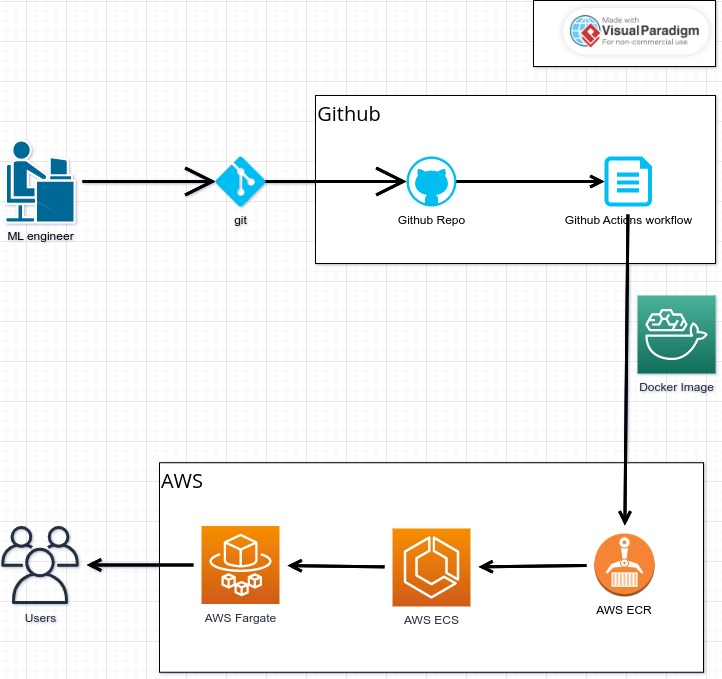

# Simple Linear Regression REST API

------------------------

This is a python project for demonstrating a REST API service for a simple linear regression model.

### System Design and Key Components:

### Install the lrservice package
https://pypi.org/project/lrservice/

### Other operations are listed in the Makefile